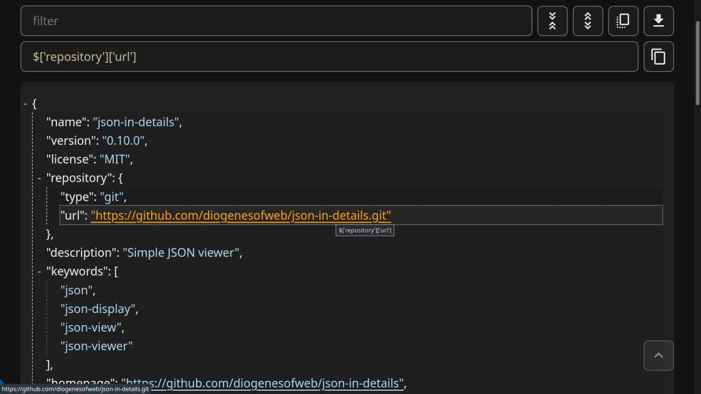

# JSON Viewer

## Web App

[live](https://json-in-details.pages.dev)



### Notes

- **Folding** is done with `<details />` element, no event listeners attached.
- **Collapse/Expand** - togging `<details />` _open_ attribute.
- **Filter** - toggling `display: none;`.

### Plus

- Foldable nodes
- Filterable nodes
- Display path on focus/hover
- Focusable nodes
- (Shift)-Tab navigation
- Keymaps (move: hjkl, collapse/expand child nodes: c/e)
- Nice light/dark theme

---

[source](./src/lib/) [npm](https://www.npmjs.com/package/json-in-details)

### Install

```bash
npm install json-in-details
# or
pnpm add json-in-details
```

---

### Usage

Examples in **svelte**

#### Example 1: view

```svelte
<script>
	// container element: add class `jid`
	// import 'json-in-details/styles.css';
	import { generate_HTML } from 'json-in-details';

	const json_object = JSON.parse('{"hello":"world"}');
	const html = generate_HTML(json_object, { escape_HTML: false, show_newline_chars: false });
	// console.log(html)
</script>

<div class="jid">{@html html}</div>
```

#### Example 2: view with functionality

```svelte
<script>
	// import 'json-in-details/styles.css';
	import init from 'json-in-details';
	import { get_path, generate_HTML, handle_keymaps } from 'json-in-details';

	let path = '?';

	const container_id = 'my-jid';
	const container_selector = `#${container_id}`;

	const { collapse, expand, filter } = init(container_selector);

	const json_object = JSON.parse('{"hello":"world","foo":{"bar":123}}');
	const html = generate_HTML(json_object, {
		escape_HTML: true,
		show_newline_chars: false,

		clickable_link: 0 // default
		// 0 = no
		// 1 = str starts with "/" or "http(s)://"
		// 2 = srt starts with "http(s)://"
		// 3 = str is a valid URL
	});
	// console.log(html)
</script>

<button on:click={collapse}>collapse</button>
<button on:click={expand}>expand</button>

<label>
	<span>Filter</span>
	<input type="text" on:input={(ev) => filter(ev.currentTarget.value)} />
</label>

<p>Path: {path}</p>

<div
	id={container_id}
	class="jid"
	on:keydown={handle_keymaps}
	on:focusin={(ev) => (path = get_path(ev))}
>
	{@html html}
</div>
```

<details>
<summary>Keymaps</summary>
  <p>h - move focus left (parent node)</p>
  <p>j - move focus down (next sibling)</p>
  <p>k - move focus up (previous sibling)</p>
  <p>l - move focus right (child node)</p>
  <p>c - collapse all child nodes</p>
  <p>e - expand all child nodes</p>
</details>

---

### Styling

1. Import `styles.css`, or just copy-past [its content](./src/lib/styles.css).
2. Add class `jid` to the container element.
3. Dark mode: add class `dark` to the container.

```css
@import 'json-in-details/styles.css' layer(jid);

/* .jid {} */
/* .jid.dark {} */
```
